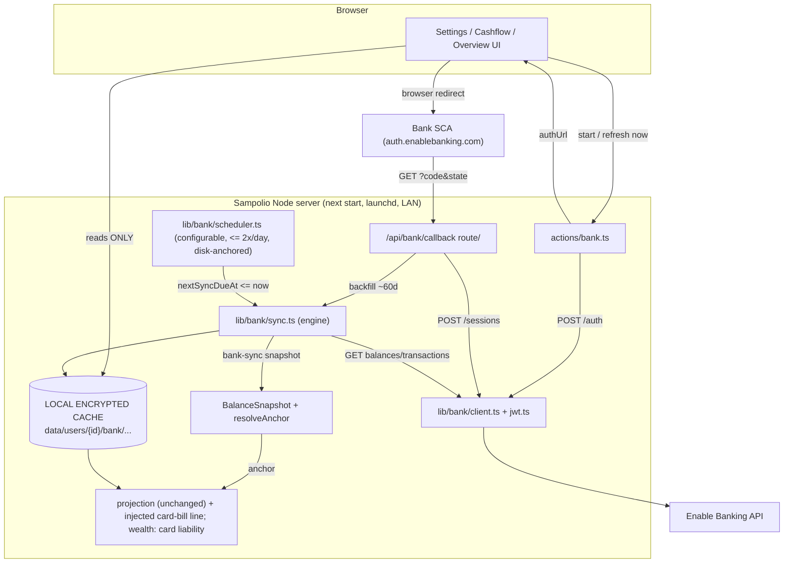
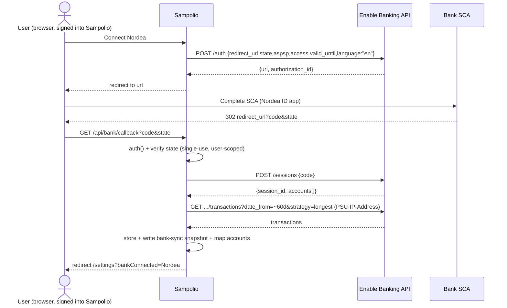

# Enable Banking (PSD2 AIS) integration — implementation plan

> **Status: code implemented (PR1–PR9), pending manual setup + sandbox verification.** The full
> application code from the roadmap (§11, PR1–PR9) is now in the codebase — types, storage, JWT/REST
> client, pure mappers/dedup/card-billing engines (unit-tested), consent flow + callback route,
> sync engine with auto-anchor, background scheduler, settings UI, Overview consent banner, the
> "All accounts" combined view, credit-card bill injection + net-worth liability, and the
> transaction ledger / `/bank` page. `pnpm build`, `pnpm lint` (new files), and `pnpm test` (229
> tests) all pass.
>
> **What's left is the parts that can't be done in code** (§13): registering the Enable Banking
> application + uploading the public key, whitelisting IBANs (Restricted Production), wiring the
> secrets into `~/sampolio/.env` + the 0600 PEM file, and exposing `/api/bank/callback` via the
> cloudflared tunnel (§8 A2). Until those secrets exist, the feature **hard-disables itself** (the
> Settings panel shows a "not configured" notice and no network calls are made). The remaining
> sandbox-verification items are in §14 (e.g. exact per-account rate allowance, which card-cycle
> fields each bank exposes).
>
> **Implemented modules:** `src/types/index.ts` (Bank* types; additive `FinancialAccount.bankSyncEnabled`,
> `BalanceSnapshot.source`); `src/lib/db/{bank-connections,bank-transactions,bank-sync-runs}.ts`
> (+ cached wrappers/tags in `cached.ts`); `src/lib/bank/{constants,jwt,client,mappers,dedup,
> card-billing,connect,sync,scheduler}.ts` (+ `mappers/dedup/card-billing` tests); `src/lib/bank-utils.ts`
> (+ test); `src/lib/schemas/bank.schema.ts`; `src/lib/actions/bank.ts`; `src/app/api/bank/callback/route.ts`;
> `src/instrumentation.ts`; `src/components/bank/*`; `/bank` page + sidebar/command-palette entries;
> card-bill injection in `projection.ts`/`actions/projection.ts`; card liability in `wealth-projection.ts`;
> Overview consent banner. **`jose` was added as a direct dependency.**

---

## 1. Context — why this change

Sampolio forecasts the user's finances from **manually entered** recurring/planned items and
**manual monthly reconciliations** (a `BalanceSnapshot` that re-anchors the forecast to a real
balance). The user wants to stop hand-feeding balances and instead pull **read-only** account
information (balances + transactions) from their three Finnish banks so forecasts stay anchored to
reality automatically.

Direct PSD2 access needs an AISP licence + eIDAS certificate the user can't get as an individual.
**Enable Banking** (Helsinki) is a licensed aggregator with one unified PSD2 API; Nordea, Danske
Bank and S-Pankki are all live in production for personal AIS, and connecting **your own** accounts
is **free** via "Restricted Production". **AIS only — no payment initiation (PIS)**.

**Accounts in scope:** the user's **Nordea** (main deposit + credit cards + cash savings), a
**Danske Bank** joint account (the mortgage is paid from it), and the wife's **S-Pankki** grocery
account. The wife is a separate Sampolio user. **Investment/fund/stock holdings are out of scope**
(not exposed via PSD2 AIS).

**Confirmed product decisions (from the user):**
1. **Account model = aggregate view.** Each real *cash/savings* account maps **1:1** to one existing
   `FinancialAccount`; "seeing cashflow across all accounts" is a new **read-only "All accounts"
   combined view**, not a grouping entity. The forecasting engine is untouched.
2. **Credit cards are modeled, not just displayed.** A linked card's statement balance is injected
   into the *paying* cash account's cashflow as a **future bill (expense)** on its due date, honoring
   the **statement-close day** + **payment-due day**; the card outstanding **also folds into
   net-worth** as a liability; and the app surfaces the **best day to shop** (just after the
   statement closes). This replaces today's manual card-expense entry — **without deleting existing data**.
3. **Multi-user: design now, build later.** Architect the shared/spouse capability up front (reusing
   the shared-mortgage pattern), but the **first build ships the user's own Nordea + the Danske
   account under the user's own consent** (he has Danske credentials). The wife's S-Pankki + joint
   visibility come later.
4. **First priority = auto-anchor balances** via the existing `BalanceSnapshot` / `resolveAnchor` path.
5. **Cache-first, low cadence.** UI reads only the **local encrypted cache**; the bank API is touched
   **only** by a background sync (**configurable, conservative default ≤ 2×/day**, with a safety margin
   under the per-account limit) and an on-demand "Refresh now" — never on page load.
6. **Seamless auth within PSD2 limits.** The app token is fully automatic/invisible; bank **consent**
   re-auth is one-click but, by law, still needs the user's SCA — alerted proactively (§6).
7. **English UI, Finland region.** Keep `fi-FI` number/currency/date formatting; new UI copy in
   **English**; request English SCA where the bank supports it.

---

## 2. Codebase + infra findings (verified, read-only)

| Area | Finding | Source |
|---|---|---|
| **Stack** | Next.js **16.2.7** (App Router), React 19, TS 6 strict, NextAuth **v5** (JWT sessions, credentials only, `AUTH_TRUST_HOST` set), Zod 4, date-fns 4. **pnpm 11.5.1**. Node **26** (nvm, baked into the plist). | `package.json`, `~/claude/docs/sampolio.md` |
| **HTTP/crypto/cron libs** | Native `fetch` only. Has `bcryptjs`,`uuid`. **No JWT lib**, **no scheduler lib** (but `jose` is transitive via NextAuth v5 — confirm `pnpm why jose`). | `package.json` |
| **Persistence** | **No DB/ORM/migrations.** AES-256-GCM **encrypted JSON files**, key from `ENCRYPTION_KEY`. Helpers in `encryption.ts`. **No file locking.** | `src/lib/db/encryption.ts` |
| **Transactions today** | App stores **NO bank transactions** — only recurring/planned items + balance snapshots. | `src/types/index.ts` |
| **Anchoring** | `resolveAnchor(genesisMonth,genesisBalance,latestSnapshot?)` starts a projection from the **latest snapshot's `yearMonth`+`actualBalance`**; `getProjection` already feeds `cachedGetLatestSnapshot('cash-account',accountId)`. **The auto-anchor hook.** | `projection.ts:172`, `actions/projection.ts` |
| **Read-only injected lines** | Mortgage/budget inject computed expense lines via `getProjection` (not stored, deep-link to source). **Template for the credit-card bill line.** | `actions/projection.ts` |
| **Net-worth engine** | `wealth-projection.ts` sums cash accounts and **subtracts debts** (`resolveAnchor(...,negate=true)`, snapshot stored negative). **The hook for card-as-liability.** | `wealth-projection.ts` |
| **Liabilities** | `Debt{…,linkedAccountId}` already models a liability **paid from** a cash account. Conceptual cousin of a card. | `src/types/index.ts` |
| **Server actions** | `'use server'`→`auth()`→Zod→db→`updateTag('user:{id}:thing')`→`ApiResponse<T>`. Cached reads use `'use cache'`+`cacheTag()`+`cacheLife('indefinite')`. | `actions/accounts.ts`, `db/cached.ts` |
| **Runtime** | Long-running `next start -p 3999 -H 0.0.0.0` under **launchd** (KeepAlive). **In-process jobs viable.** No scheduler today; `setInterval` used for in-memory housekeeping. | `~/claude/docs/sampolio.md` |
| **Networking (corrected)** | **`sampolio.machadolucas.me` is LAN-ONLY**: Caddy (`/opt/homebrew/etc/Caddyfile`) reverse-proxies it (`→192.168.1.121:3999`, TLS via Cloudflare DNS-01) and a **split-horizon DNS rewrite** resolves it on the LAN. It is **NOT** in the cloudflared `ingress` (only `ha.` + `photos.` are public). **The public internet cannot reach it today.** | `~/claude/docs/{caddy,cloudflared,sampolio}.md`, `~/.cloudflared/config.yml` |
| **Secrets (corrected)** | Source of truth = **`~/sampolio/.env`** (gitignored), `source`-d by `install-launchd.sh`/`run-sampolio.sh` and **baked into the launchd plist** `EnvironmentVariables`; data-dir dot-files are only a fallback (and the data-dir `.encryption_key` may be **stale** — not a reliable backup). | `~/claude/docs/sampolio.md` |
| **API routes** | **Only** `api/auth/[...nextauth]` + dev-only `dev-login`. `proxy.ts` gates by session cookie + rate-limits. | `src/app/api/`, `src/proxy.ts` |
| **Multi-user template** | Shared mortgage: global `data/shared/`, global key, **action-layer ACL** (`loadMortgageForMember`), reverse index, members by email, member-agnostic cache tag. | `src/lib/{db,actions}/shared-mortgages.ts` |
| **Logging/locale** | Raw `console.*`; emails logged; no tokens/passwords logged. `fi-FI` formatting hardcoded. | `auth.ts`, `constants.ts` |

---

## 3. Enable Banking API — verified facts (with flags)

Verified against `https://enablebanking.com/docs`. ✅ confirmed · ⚠️ verify in sandbox · ❌ corrected.

- ✅ **App auth:** JWT **RS256**; header `kid=<application_id>`; claims `iss="enablebanking.com"`,
  `aud="api.enablebanking.com"`, `iat`, `exp` (**max 24h**); `Authorization: Bearer`. Base
  `https://api.enablebanking.com`. **Server-side, invisible to the user.**
- ❌ **SDK:** no maintained official npm SDK → **plain REST + `jose`** (decided, §6).
- ✅ **Flow:** `GET /aspsps?country=FI` → `POST /auth` (`access.valid_until`, `aspsp{name,country}`,
  `psu_type:"personal"`, `state`, `redirect_url`, optional `language:"en"`; returns `{url, authorization_id}`)
  → SCA at `auth.enablebanking.com` → redirect `redirect_url?code=&state=` → `POST /sessions` (`{code}`
  → `{session_id, accounts:[{account_id/uid, iban, currency, name}]}`) → `GET /accounts/{uid}/balances`,
  `GET /accounts/{uid}/transactions?date_from=&date_to=&continuation_key=&strategy=longest`. Use
  **`account_uid`** for data calls. `DELETE /sessions/{id}` revokes.
- ❌ **Consent validity:** up to **180 days** (bank-dependent). **No refresh without full re-SCA**
  (PSD2 law). Store the **returned** `access.valid_until`. Expiry → `EXPIRED_SESSION`/401.
- ⚠️ **History window — LOW concern.** Long history only ~1h post-auth, then ~90 days. **Sampolio
  doesn't model the past, so we fetch only ~60 days** (one card cycle) — window risk is moot. Confirm
  ~60 days is reliably available per bank.
- ⚠️ **Rate limits:** ~**4 unattended fetches/day/account** (PER ACCOUNT, not per user/app); more when
  present via **`PSU-IP-Address`**. Breach → **429** + `ASPSP_RATE_LIMIT_EXCEEDED`. **Confirm exact
  per-account allowance** so we can tune the margin/cadence.
- ✅ **Transactions:** dedup key **`entry_reference`** (stable booked; null/unstable pending → synthetic
  composite key). Balances: `closingBooked`,`expected`,`interimAvailable`; **card available limit +
  outstanding** appear in balances.
- ⚠️ **Card billing-cycle metadata** (statement-close/due day) generally **NOT** in AIS → plan for
  **manual per-card config**; derive statement balance from balances and/or per-cycle transaction sums.
- ✅ **Restricted Production = FREE** for own accounts, whitelisted by **IBAN in the control panel,
  PER APPLICATION**; non-whitelisted → empty. **Sandbox + Mock ASPSP** exist. **eIDAS not required.**
- ⚠️ **Spouse eligibility / free cap:** confirm (a) the free-tier IBAN/account **cap** covers all our
  accounts (~5–6: Nordea deposit+savings+card(s) + Danske + S-Pankki), and (b) whether one application
  may include a **household member's** account or the wife needs her **own** Enable Banking app/key.
- ❌ **Investments/funds/stocks NOT exposed** — out of scope (cash savings, as payment accounts, are in).

---

## 4. Proposed architecture

### 4.1 Data flow (cache-first)



The encrypted JSON files **are** the cache. Every page/projection reads them via the existing
`'use cache'` wrappers; the API is contacted only by the background sync + "Refresh now".

### 4.2 New modules

| Module | Path | Mirrors |
|---|---|---|
| Types + `FinancialAccount`/`BalanceSnapshot` extensions | `src/types/index.ts` | existing sections |
| Connection CRUD + **uncached** session-secret accessor | `src/lib/db/bank-connections.ts` | `shared-mortgages.ts`, `accounts.ts` |
| Transaction store (upsert by dedup key) | `src/lib/db/bank-transactions.ts` | `reconciliation.ts` |
| Sync-run audit (capped) | `src/lib/db/bank-sync-runs.ts` | `reconciliation.ts` |
| Cached wrappers + tags | extend `src/lib/db/cached.ts` | existing |
| JWT minter (RS256, memory-cached, `jose`) | `src/lib/bank/jwt.ts` | — |
| REST client (native fetch, typed `BankApiError`) | `src/lib/bank/client.ts` | — |
| Pure mappers **+ test** | `src/lib/bank/mappers.ts` | `mortgage-utils.ts` |
| Pure dedup/merge **+ test** | `src/lib/bank/dedup.ts` | `budget-utils.ts` |
| **Card-billing engine** (cycle→bill month/amount, best-shop-day) **+ test** | `src/lib/bank/card-billing.ts` | `mortgage-utils.ts` |
| Sync engine | `src/lib/bank/sync.ts` | — |
| Scheduler (one idempotent `setInterval`) | `src/lib/bank/scheduler.ts` | `users.ts`/`proxy.ts` |
| Constants (incl. configurable cadence/margin) | `src/lib/bank/constants.ts` | `src/lib/constants.ts` |
| Consent-expiry helper **+ test** | `src/lib/bank-utils.ts` | `isEuriborUpdateDue` |
| Zod schemas (inputs + defensive API parsers) | `src/lib/schemas/bank.schema.ts` | `mortgage.schema.ts` |
| Server actions | `src/lib/actions/bank.ts` | `accounts.ts`, `shared-mortgages.ts` |
| Aggregate view + **card-bill injection** | extend `src/lib/actions/projection.ts` | `getMortgageTransfersForAccount` |
| **Card-as-liability** | extend `src/lib/wealth-projection.ts` | the debt `negate=true` branch |
| **Callback route** (only new HTTP route) | `src/app/api/bank/callback/route.ts` | `api/auth/[...nextauth]` |
| Scheduler boot hook | `src/instrumentation.ts` (`register()`) | Next.js idiom |
| UI: bank panel, ledger, card detail, banner | `src/components/bank/*`, `settings/`, `overview/`, `cashflow/` | `src/components/mortgage/*` |

---

## 5. Data model changes — additive & non-destructive

> **Data safety:** every change is an **optional, additive field** or a **new file type**. Existing
> `.enc` files load unchanged (missing fields → `undefined`); `BalanceSnapshot.source` defaults to
> `'manual'` for all existing snapshots. **No record is rewritten or deleted by the migration.**
> Linking a card does **not** touch existing manual card-expense items — the app *prompts* the user to
> disable them (avoid double-counting) but **never auto-deletes**. The background sync writes only
> bank-namespaced files + *upserts* snapshots, serialized by a per-connection lock, so it can't clobber
> user edits.

### 5.1 New types (`src/types/index.ts`)

```ts
// === ENABLE BANKING (PSD2 AIS) ===
export type BankConnectionStatus = 'pending' | 'active' | 'expired' | 'error' | 'revoked';
export type BankAccountRole = 'cash' | 'credit-card' | 'savings' | 'other';
export type BankTransactionStatus = 'booked' | 'pending' | 'other';

export interface BankAccountLink {
  id: string;                  // our uuid; STABLE across re-consent (re-matched by accountUid/iban)
  connectionId: string;
  accountUid: string;          // Enable Banking account_id (API calls)
  iban?: string;               // stored; masked in UI + never logged
  name?: string; currency: Currency; accountRole: BankAccountRole;
  linkedFinancialAccountId?: string;  // cash/savings: account it ANCHORS. card: account it's PAID FROM.
  // --- credit-card billing (role === 'credit-card') ---
  statementDay?: number; paymentDueDay?: number;     // 1-31, manual config (maybe from API)
  creditLimit?: number; lastStatementBalance?: number; lastStatementDate?: string; // 'YYYY-MM-DD'
  // --- balances / cursor ---
  lastBalance?: number; lastBalanceType?: string; lastBalanceAt?: string;
  syncCursor?: { lastBookingDate?: string; lastSeenEntryRefs?: string[]; backfilledThrough?: string };
  isExcluded?: boolean;
}

export interface BankConnection {
  id: string; userId: string;
  aspspName: string; aspspCountry: string;
  applicationId?: string;      // which Enable Banking app/key this consent belongs to (per-user-app ready)
  status: BankConnectionStatus; psuType: 'personal';
  linkedAccounts: BankAccountLink[];
  consentGrantedAt?: string; consentExpiresAt?: string;   // = returned access.valid_until
  nextSyncDueAt?: string;      // persisted scheduler cursor (restart-safe)
  lastSyncAt?: string; lastSyncStatus?: 'ok'|'partial'|'error'; lastError?: string; // code only
  createdAt: string; updatedAt: string;
}

export interface BankSessionSecret {  // SEPARATE FILE; never cached, never logged
  connectionId: string; state: string; authorizationId?: string; sessionId?: string; createdAt: string;
}

export interface BankTransaction {
  id: string; linkedAccountId: string;
  dedupKey: string;            // entry_reference (booked) OR synthetic hash (pending)
  entryReference?: string; bookingDate: string; valueDate?: string;
  amount: number;              // signed (credit +, debit -)
  currency: Currency; status: BankTransactionStatus;
  counterpartyName?: string; remittanceInfo?: string; bankTransactionCode?: string;
  firstSeenAt: string; lastSeenAt: string;
}

export interface BankSyncRun {
  id: string; connectionId: string;
  trigger: 'callback-backfill' | 'scheduled' | 'manual';
  startedAt: string; finishedAt?: string; status: 'ok'|'partial'|'error';
  perAccount: Array<{ linkedAccountId: string; balanceFetched: boolean; txAdded: number; txUpdated: number;
    fromDate?: string; toDate?: string; error?: string; rateLimited?: boolean }>;
  psuPresent: boolean; error?: string;
}
```

### 5.2 Extensions (optional → back-compat)

```ts
export interface FinancialAccount { /* ... */ bankSyncEnabled?: boolean; }
export interface BalanceSnapshot  { /* ... */ source?: 'manual' | 'bank-sync'; }
```

`linkedFinancialAccountId` is **dual-purpose**: for `cash`/`savings` it's the account the balance
**anchors**; for `credit-card` it's the cash account the bill is **paid from** (like `Debt.linkedAccountId`).
`applicationId` makes the model **ready for per-user Enable Banking apps** (needed if the spouse must use
her own app/key — see §12); phase 1 uses one app.

### 5.3 On-disk layout + cache tags

**Phase 1 (per-user, incl. Danske under the user's own consent):**
```
data/users/{userId}/bank/
  connections/{id}.enc            # BankConnection (cacheable)
  connections/{id}.session.enc    # BankSessionSecret (NEVER cached / logged)
  accounts/{linkedAccountId}/transactions.enc
  sync-runs/{connectionId}.enc
```
**Shared layer (designed now, built later — mirrors shared mortgage):**
```
data/shared/bank-accounts/{id}.enc · {id}/transactions.enc · bank-account-members/{userId}.enc
```
New tags: `user:{userId}:bank-connections`, `…:bank-connection:{id}`,
`…:bank-account:{linkedAccountId}:transactions`, `…:bank-connection:{id}:runs`. Link changes also
`updateTag('user:{userId}:accounts')`; snapshots → `…:reconciliation`. Session secret **never** `'use cache'`.

---

## 6. Auth + consent + re-consent (two layers)



**Layer A — app token (fully automatic, invisible).** `bank/jwt.ts` mints the RS256 JWT with **`jose`**
(decided: audited, ESM, Node-crypto, already transitive via NextAuth). Memory-cached, re-minted ~5 min
before the 24h expiry. The user never sees it; one token is reused (requests minimized).

**Layer B — bank consent (one-click, but SCA is legally required).** PSD2 **forbids** silent renewal —
the user **must** redo SCA (~every 180 days). "Seamless" = everything except that periodic SCA is
automatic: the live `session_id` is cached and reused; expiry is detected **proactively**
(`consentExpiresAt`) and **reactively** (`EXPIRED_SESSION`/401); a **proactive Overview alert** ≤14 days
ahead offers **one-click Reconnect**; stale data stays read-only until renewed; link-id reuse keeps
mappings + transactions attached.

**Secrets** (the app's real convention — `~/sampolio/.env` baked into the launchd plist by
`install-launchd.sh`; **hard-disable if missing**, never default a secret):
- `ENABLE_BANKING_APP_ID` (the `kid`), `ENABLE_BANKING_REDIRECT_URL`, optional `ENABLE_BANKING_BASE_URL`
  (sandbox toggle) → in `~/sampolio/.env`.
- `ENABLE_BANKING_PRIVATE_KEY_FILE` → path to a **0600 PEM file outside the repo** (e.g.
  `~/.sampolio/enable_banking_private_key.pem`); the app reads the key from that path (cleaner than a
  multiline value in `.env`). The key stays in memory via `jose`.

**Callback route** (`src/app/api/bank/callback/route.ts`, `GET`): require `auth()`; CSRF = match the
pending connection *for this user* by single-use `state`; `POST /sessions`; persist `session_id`, map
accounts (reuse ids), set `status='active'`, `consentExpiresAt` = returned value, `nextSyncDueAt = now`;
run the **~60-day backfill synchronously within the request**; redirect to settings. The same hostname is
used throughout so the `__Secure-authjs.session-token` cookie is present for `auth()` (see §8).

---

## 7. Sync strategy (cache-first, configurable cadence, safe margin)

- **Cadence (configurable constant, conservative default):** background scheduler runs each connection
  **≤ 2×/day** by default — well under the ~4/day **per-account** limit — even while the app is unused.
  A per-account **daily budget tracker keeps a safety margin** (reserve headroom for on-demand
  refreshes; never exhaust the limit). If sandbox confirms a higher allowance we can raise the cap and
  still keep margin. **No fetch on page load.** "Refresh now" (PSU present → `PSU-IP-Address`, higher
  allowance) covers manual freshness; soft min-interval ≥5 min/connection.
- **Two users don't compound:** the limit is **per account**. Each user's connections are separate
  accounts; the **shared Danske account is synced exactly once** (by the consent owner, not by both
  members) so it never doubles against the budget.
- **Backfill at consent (~60 days):** `…/transactions?date_from=today-60d&date_to=today&strategy=longest`
  following `continuation_key`. We deliberately don't chase deep history (Sampolio doesn't model the
  past; 60 days covers a card cycle) — sidesteps the ~1h history-window risk.
- **Incremental cursor = `lastBookingDate` high-water mark + small `lastSeenEntryRefs` overlap set**
  (not `continuation_key`, which is intra-response paging). Fetch `date_from = lastBookingDate − 3 days`,
  `date_to = today`; overlap absorbed idempotently by the dedup upsert.
- **Idempotent upsert + pending→booked:** upsert by `dedupKey`; a booked tx replaces its matching
  synthetic-keyed pending row. Balances prefer `closingBooked`; capture card limit + outstanding.
- **Auto-anchor write (keystone, PR5):** when a cash/savings balance is fresh,
  `createBalanceSnapshot(userId,'cash-account',financialAccountId,currentMonth,expected,actual,source:'bank-sync')`;
  `expected` = current-month running balance from a baseline `calculateProjection`. **Manual snapshots
  always win** (bank balance shown as a diff, not overwritten). `resolveAnchor` re-bases — zero engine change.
- **Card bill + liability (PR8):** `bank/card-billing.ts` maps `statementDay`/`paymentDueDay` + statement
  balance → `(billYearMonth, amount)`; `getProjection` injects a read-only **`credit-card` expense line**
  into the paying account; `wealth-projection.ts` includes the card outstanding as a **liability** (§12).
- **Rate handling:** `429 + ASPSP_RATE_LIMIT_EXCEEDED` → backoff (`nextSyncDueAt = now+backoff`), mark
  `rateLimited` (not `error`). Budget spent → push to next UTC midnight.
- **Scheduler:** in-process `setInterval` (~30 min tick), **disk-anchored** via `nextSyncDueAt` (restart
  delays at most one tick; backfill is callback-driven + cursor-resumable). Registered from
  `src/instrumentation.ts` `register()`, guarded by a `started` flag + in-flight `Map<connectionId,Promise>` lock.

---

## 8. Redirect / callback reachability (corrected) + secrets

**Reality:** `sampolio.machadolucas.me` is **LAN-only** today — Caddy + a split-horizon DNS rewrite
serve it inside the network; it's **not** in the cloudflared tunnel. The bank's SCA redirect is a
**browser** 302, so the device finishing consent must reach the callback URL.

| Option | What it does | Trade-off |
|---|---|---|
| **A2 — expose ONLY `/api/bank/callback` via the tunnel (recommended)** | Add a **path-scoped** ingress rule + a public DNS route, keeping the rest of the app off the internet. **Same hostname**, so the session cookie + CSRF design hold. LAN access is unchanged (split DNS still wins on-LAN). | Smallest new public surface (one GET path); works from any device the user is signed into. Requires editing `~/.cloudflared/config.yml` + `cloudflared tunnel route dns` + restart — **I can do this during implementation**, or hand over steps (§13). |
| **C — keep LAN-only, consent from a LAN device** | Register the LAN-only HTTPS URL (cert is publicly valid via DNS-01); always start+finish consent on a device on the home wifi (the bank SCA is out-of-band via the bank app, returning to that browser). | **Zero infra change**, but fragile: depends on Enable Banking accepting a non-public redirect, and forces every ~180-day re-consent to happen on-LAN. Try first only if A2 is undesirable. |
| **A1 — expose the whole app via the tunnel** | One ingress line. | Turns the finance app internet-facing — **rejected** (you deliberately kept it LAN-only). |

**Recommended A2 config** (`~/.cloudflared/config.yml`):
```yaml
ingress:
  - hostname: sampolio.machadolucas.me
    path: ^/api/bank/callback        # only this path is public
    service: http://localhost:3999
  - hostname: ha.machadolucas.me
    service: http://homeassistant.local:8123
  - hostname: photos.machadolucas.me
    service: http://localhost:2283
  - service: http_status:404         # everything else stays unreachable
```
then `cloudflared tunnel route dns home sampolio.machadolucas.me` (public CNAME → tunnel) and restart via
`launchctl bootout/bootstrap` (per `~/claude/docs/cloudflared.md`). The existing LAN DNS rewrite for
`sampolio.machadolucas.me` overrides on-LAN, so LAN users keep full Caddy access; only the callback path
is reachable publicly. **Verify:** a request arriving via the tunnel carries the `__Secure-authjs.session-token`
cookie and NextAuth (with `AUTH_TRUST_HOST` + `X-Forwarded-Proto`) treats it as authenticated.

**Secrets:** per §6 — `~/sampolio/.env` (baked into the plist) for ids/URLs; a 0600 PEM file outside the
repo for the private key. The RSA key never enters the repo, is never logged, and stays in memory.
I **cannot** perform the parts inside the user's Enable Banking account (control-panel app registration,
public-key upload, IBAN whitelisting) — steps in §13.

---

## 9. Error / expiry handling & alerting

- **Typed `BankApiError`:** `EXPIRED_SESSION`/401 → `expired`, stop syncing; `429` → backoff +
  `rateLimited`; 5xx/network → transient backoff, stay `active`, **no mutation on a failed fetch**.
- **Per-account isolation:** loop links in individual try/catch; one failure → `partial`, others
  continue. **One bank down / one consent expired never breaks the others.**
- **Partial-sync safety:** only write the re-anchor snapshot / card bill when the relevant balance is
  fresh this run.
- **Restart safety:** all scheduling/cursor state on disk; interrupted runs resume via the 3-day overlap
  + idempotent upsert.
- **Alerting:** `isConsentExpiringSoon` (≤14 days / expired) → Overview banner **identical to
  `isEuriborUpdateDue`**, fed by `getBankConnectionsNeedingAttention()`; one-click Reconnect.
- **PII redaction:** `redactBankError()` before `console.error`; logs carry only `aspspName`, counts,
  durations, error **codes** — never IBANs, `session_id`, `code`, `state`, counterparties, or amounts.

---

## 10. Testing approach

- **Sandbox + Mock ASPSP first** (`ENABLE_BANKING_BASE_URL`): verify endpoint shapes, the ~60-day fetch,
  rate-limit counting, pending→booked, and **what card-cycle/balance fields each bank exposes**.
- **Unit (vitest)**, mirroring `mortgage-projection.test.ts`/`budget-utils.test.ts`: `mappers.ts`,
  `dedup.ts`, **`card-billing.ts`** (cycle→bill month/amount, best-shop-day, month boundaries),
  `bank-utils.ts`, aggregate summation, snapshot-provenance (manual-wins), card-as-liability netting.
- **Integration:** `client.ts` vs sandbox; full consent E2E; **the tunnel callback path** (cookie +
  `auth()` via `X-Forwarded-Proto`); backfill + cursor; CSRF/state.
- **Local:** `sampolio-preview` (4999, `/dev-login`) on a **copy** of prod data + a sandbox app; drive the
  connect UI; confirm the re-anchored forecast, the card bill, and the net-worth liability with `preview_*`.
  **Never** point dev at prod data or port 3999.
- **Restricted Production cutover:** whitelist the IBANs, real consents, watch `BankSyncRun` a week.

---

## 11. Phased implementation roadmap (PR-sized; auto-anchor first)

0. **PR0 — Setup:** save `docs/enable-banking-integration.md`; register a **Sandbox** app (§13).
1. **PR1 — Types + storage skeleton (no network):** types + `bankSyncEnabled` + `BalanceSnapshot.source`;
   `db/bank-connections.ts`, `bank-transactions.ts`, `bank-sync-runs.ts` + cached/tags. Additive,
   unit-tested. (Data-safety checkpoint: old `.enc` files still load.)
2. **PR2 — Pure utils + JWT + client (sandbox):** `constants.ts`, `jwt.ts` (`jose`), `client.ts`,
   `mappers.ts`(+test), `dedup.ts`(+test), `bank.schema.ts`. Verify shapes on Mock ASPSP.
3. **PR3 — Consent flow + callback reachability:** `actions/bank.ts` + callback route + CSRF + settings
   "Connect a bank" UI + account→`FinancialAccount` mapping. **Apply the A2 tunnel path-exposure (§8)**
   and verify the cookie/`auth()` path through the tunnel. E2E on sandbox.
4. **PR4 — Backfill (~60d) + incremental engine:** `bank/sync.ts`, `BankSyncRun`, "Refresh now". Validate
   pending→booked + 60-day availability.
5. **PR5 — Auto-anchor (keystone):** write `source:'bank-sync'` snapshots; manual-wins guard. **Delivers
   the #1 priority.**
6. **PR6 — Scheduler + configurable cadence + margin + resilience + expiry banner:** `instrumentation.ts`
   boot, disk-anchored `nextSyncDueAt`, per-account budget + safety margin, 429 backoff, isolation, locks,
   Overview reconnect banner, PII redaction.
7. **PR7 — Aggregate "All accounts" cashflow/overview** (read-only summation).
8. **PR8 — Credit-card billing + liability:** `card-billing.ts` + per-card cycle config UI + injected
   read-only **`credit-card` bill line** + **net-worth liability** (`wealth-projection.ts`) + "best day to
   shop" + **migration prompt** to disable manual card-expense items (never auto-delete). (§12)
9. **PR9 — Transaction ledger page** (read-only, mirrors `mortgage-ledger-table.tsx`).
10. **PR10 — Restricted Production cutover** (whitelist Nordea + Danske IBANs under the user's consent).
11. **Later (designed now):** shared joint Danske + wife's S-Pankki (clone the shared-mortgage stack;
    decide single-app-whitelist vs per-user app/key per §12; migrate Danske per-user→shared);
    **auto-reconciliation**; **mortgage-debit cross-check**; **recurring-item suggestions**; **Splitwise grocery split**.

---

## 12. Integrating with current Sampolio features

- **Balances → forecasting (PR5, keystone):** auto-write `BalanceSnapshot(source:'bank-sync')` for the
  current month so `resolveAnchor` starts every forecast from the true balance; cache-first; manual wins.
- **"All accounts" cashflow (PR7):** `Promise.all(accounts.map(getProjection))` summed per month (reuses
  the `WealthProjectionMonth.cashAccountsTotal/Breakdown` idea). Single-account views unchanged.
- **Credit cards (PR8):**
  - **Cashflow bill:** the card's **statement balance** is injected as a **future expense** into the
    **paying** cash account in the month of `paymentDueDay` (the established read-only-injection pattern,
    `source:'credit-card'`, deep-links to the card detail). Closed statement → firm bill; current open
    cycle → clearly-labeled *estimate* on the next due month.
  - **Net-worth liability (now in scope):** the card **outstanding** folds into `wealth-projection.ts` as
    a liability (mirrors the `Debt` `negate=true` branch), so net worth = assets − card debt. **No double
    count:** net worth is a point-in-time assets−liabilities figure; the cashflow bill is a *timing* line
    — distinct views of the same obligation.
  - `statementDay`/`paymentDueDay` are **configured per card** (AIS usually omits them); the statement
    balance comes from balances and/or per-cycle transaction sums. **Best day to shop** = the day after
    the statement closes (max interest-free float) — an insight on the card detail.
  - **Migration (no data loss):** on linking a card, **prompt** the user to archive/disable the manual
    card-expense item to avoid double-counting; **never auto-delete**. Manual entry continues until PR8.
- **Transactions (PR9 → later):** Phase 1 = read-only ledger (the balance/bill, not summed transactions,
  drive forecasts — avoids double-counting). Later = categorize + auto-reconcile (pre-fill the reconcile
  wizard) + suggest recurring items (never auto-create).
- **Mortgage tie-in (later, verify-only):** compare the Danske mortgage debit to the engine's expected
  charge on `/mortgage`; optionally **seed** a `MortgageActualEntry` (user confirms the split). The bank
  debit never becomes an independent forecast line.
- **Spouse / shared (later):**
  - The wife connects her **own** S-Pankki from **her** login (her consent, her SCA); the joint **Danske**
    is shared via the shared-mortgage pattern (global doc + members + reverse index + action-layer ACL),
    consent single-owner, both read.
  - **IBAN whitelisting:** Restricted Production returns data only for IBANs whitelisted **in the control
    panel, per application**. Since Sampolio uses one application today, **you (the app owner) enter all
    household IBANs there up front** (Nordea + Danske + the wife's S-Pankki) before any data flows; she
    still performs her own SCA. **Two confirmations needed** (§14): the free-tier IBAN **cap**, and whether
    one app may include her account or she needs **her own Enable Banking app/key**. The model carries an
    `applicationId` so the shared phase can support per-user apps without a rewrite if required.
- **Investments:** out of scope (not in AIS); `InvestmentAccount` stays manual.
- **Locale/language:** keep `fi-FI` formatting; new UI copy in **English**; pass `language:'en'` to
  `POST /auth` where supported.

---

## 13. Manual setup steps (the parts I can't do for you)

1. Create an Enable Banking account; register an **Application** (start in **Sandbox**).
2. Generate an **RSA keypair**; upload the **public** key, get the **Application ID** (`kid`). Keep the
   private key offline. *(I can generate the keypair locally during implementation.)*
3. Register the **redirect URL** `https://sampolio.machadolucas.me/api/bank/callback` (+ a localhost one
   for sandbox dev).
4. **Make the callback reachable (A2):** add the path-scoped cloudflared ingress rule + DNS route from §8
   and restart cloudflared. *(I can do this during implementation given the documented procedure.)*
5. **Production:** enable **Restricted Production** and **whitelist your IBANs** — Nordea + Danske for
   phase 1; add the wife's S-Pankki when the shared phase ships.
6. **Secrets:** put `ENABLE_BANKING_APP_ID`, `ENABLE_BANKING_REDIRECT_URL` (+ `ENABLE_BANKING_BASE_URL`
   for sandbox) in **`~/sampolio/.env`**, save the private key as a **0600 PEM file** under `~/.sampolio/`
   and set `ENABLE_BANKING_PRIVATE_KEY_FILE` to its path; re-run `./scripts/install-launchd.sh` to bake the
   env into the plist. *(I can do the `.env`/plist wiring during implementation.)*
7. **eIDAS:** not required for Restricted Production with own accounts.

---

## 14. Open questions / decisions still needed

**Resolved by the user:** aggregate-view model; credit cards modeled (bill in cashflow **+ net-worth
liability**); shared = design-now-build-later; first priority = auto-anchor; cache-first + configurable
cadence with margin; redirect = **A2 (expose only the callback via the tunnel)**; JWT = **`jose`**; Danske
SCA by the user; **English UI / FI region**; funds/stocks **out**.

**Still to confirm (low-stakes; defaults noted):**
1. **Free-tier IBAN cap + spouse eligibility:** does the free Restricted Production cap cover ~5–6 IBANs,
   and may one application include the wife's account, or does she need her **own** app/key? *(Default:
   one app for phase 1; `applicationId` field keeps per-user apps open for the shared phase.)*
2. **Card billing-cycle data:** do the banks expose statement-close/due dates + statement balance via AIS,
   or is per-card manual config required? *(Default: manual config; confirm in sandbox.)*
3. **Open-cycle bill:** include the current not-yet-closed card spend as an estimated next-month bill, or
   only closed statements? *(Default: closed = firm, open = labeled estimate.)*
4. **~60-day backfill:** enough, or prefer ~90 for a long cycle+grace? *(Default: 60, bump if needed.)*
5. **Per-account rate allowance:** confirm the exact unattended limit to tune the cadence/margin. *(Default:
   ≤2×/day with reserved headroom.)*
6. **Tunnel cookie path:** confirm `auth()` succeeds for callback requests arriving via the tunnel
   (`X-Forwarded-Proto`/`AUTH_TRUST_HOST`) — verify in PR3. *(Expected to work as `ha.`/`photos.` do.)*

---

## 15. Critical files to reference during implementation

- `src/types/index.ts` — new types; additive extensions to `FinancialAccount`, `BalanceSnapshot`.
- `src/lib/projection.ts:172` (`resolveAnchor`) + `src/lib/db/reconciliation.ts` — anchor hook + snapshot
  store to **reuse** for auto-anchoring.
- `src/lib/actions/projection.ts` — `cachedGetLatestSnapshot('cash-account',accountId)`→`calculateProjection`;
  `getMortgageTransfersForAccount`/`getBudgetTransfersForAccount` injection precedent for the **card bill line**.
- `src/lib/wealth-projection.ts` — the debt `negate=true` branch to mirror for the **card liability**.
- `src/lib/{db,actions}/shared-mortgages.ts` — multi-user template for the later shared Danske account.
- `src/lib/db/cached.ts` — cache-tag conventions.
- `src/app/api/auth/[...nextauth]/route.ts` + `src/proxy.ts` — the only existing route handler + the gate
  the new `src/app/api/bank/callback/route.ts` must fit beside.
- `src/app/(dashboard)/overview/page.tsx` — `isEuriborUpdateDue` banner to mirror for consent expiry.
- `src/components/mortgage/mortgage-ledger-table.tsx` — read-only ledger to mirror for transactions.
- Infra: `~/.cloudflared/config.yml`, `/opt/homebrew/etc/Caddyfile`, `~/claude/docs/{cloudflared,caddy,sampolio}.md`,
  `~/sampolio/scripts/install-launchd.sh` — for the A2 callback exposure + secret wiring.

---

## 16. Known constraints carried from Sampolio

- **`sampolio.machadolucas.me` is LAN-only** — the integration adds a **single public path**
  (`/api/bank/callback`) via the tunnel (A2); the rest of the app stays private.
- **No file locking** — serialize per-connection writes with an in-process `Map` lock; single node, so
  cross-process contention is moot; the sync only upserts + writes bank-namespaced files.
- **No cross-currency conversion** — assumes EUR.
- **Locale:** `fi-FI` formatting kept; UI copy in English; English SCA where supported.
- **Secrets never default** — a missing Enable Banking key/app-id **hard-disables** the feature; secrets
  live in `~/sampolio/.env` + a 0600 PEM file, baked into the launchd plist (per the app's convention).
- **Data safety** — all schema changes additive; no existing record rewritten or deleted; linking a card
  never auto-removes the user's manual card-expense items (prompt-only).
```
